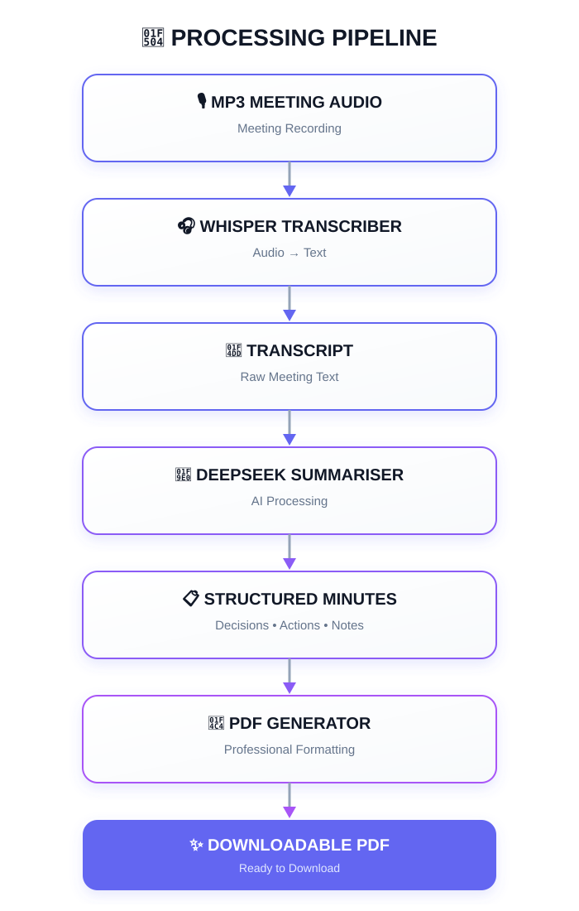

# 🎙️ Meeting Minutes Summariser

An AI-powered tool that transforms meeting recordings into **concise, structured meeting minutes** and generates a **downloadable PDF**.

The application uses **Whisper** for transcription and **DeepSeek** for summarisation, with a Gradio-based user interface.

---

## ✨ Features

- 🎧 Upload an MP3 meeting recording
- 📝 Automatically transcribe meeting audio
- 🤖 Generate concise and structured meeting minutes
- 📄 Generate a PDF containing the final minutes
- ⬇️ Download the generated PDF
- 🔐 Optional authentication for the Gradio UI
- 🐳 Run the application using Docker

---

## 🧠 Models

| Task | Model |
|---|---|
| 🎙️ Transcription | `openai/whisper-medium.en` |
| 📝 Summarisation | `deepseek-ai/DeepSeek-R1-Distill-Qwen-1.5B` |

---

## ⚙️ Requirements

> **CUDA is required.**
> This project is designed to run with a CUDA-compatible NVIDIA GPU. CPU-only execution is **not supported/recommended**.

### Native Installation

- 🐍 Python 3.10+
- 📦 [UV](https://docs.astral.sh/uv/)
- 🎞️ FFmpeg
- 🖥️ CUDA-compatible NVIDIA GPU
- 🌐 Internet connection for downloading the required models

### Docker

For Docker-based execution:

- 🐳 Docker
- 🖥️ CUDA-compatible NVIDIA GPU
- 📦 WSL if on windows
- 🌐 Internet connection for downloading the required models

---

## 🚀 Setup

### 1. Clone the Repository

```bash
git clone https://github.com/joelsjoyt/meeting-minutes-summarizer.git
cd meeting-minutes-summarizer-main
````

 ### 2\. Install Dependencies

```
uv sync
```

 ### 3\. Activate the Virtual Environment

 #### Linux / macOS

```
source .venv/bin/activate
```

 #### Windows

```
.venv\Scripts\Activate.ps1
```

---

 ## 🔧 Configuration

 Application configuration can be modified in:

```
utils/config.py
```

 You can configure:

 - 🤖 Transcription model
- 🧠 Summarisation model
- 📂 Model directory
- 🔢 Maximum tokens
- 🔐 Gradio authentication credentials

 For the Gradio UI, configure:

```
GRADIO_USER_NAME=set_desired_value
GRADIO_USER_PASS=set_desired_value
```

 These values are used as the login credentials for the Gradio interface.

---

 ## ▶️ Run Locally

 After completing the setup, start the application with:

```
python app.py
```

 Or using UV:

```
uv run python app.py
```

 The Gradio interface will then be available through the URL displayed in the terminal.

---

 # 🐳 Docker

 The application can also be built and run inside a Docker container.

 > **Note:** Docker execution requires access to an NVIDIA GPU and the appropriate NVIDIA container runtime.

 ## Build the Docker Image

 Build the image using:

```
docker build -t meeting-minutes-summarizer .
```

 Run the application with GPU access:


```
docker run -d --gpus all \
  -p 7860:7860 \
  -e GRADIO_USER_NAME=set_desired_value \
  -e GRADIO_USER_PASS=set_desired_value \
  meeting-minutes-summarizer
```

---

 ## 📝 Usage

 1. 🎧 Upload an **MP3 meeting recording**.
2. 🎙️ The audio is transcribed using **Whisper**.
3. 🤖 The transcript is summarised using **DeepSeek**.
4. 📄 A PDF containing the meeting minutes is generated.
5. ⬇️ Download the resulting PDF.

 ### Input

```
Meeting audio (.mp3)
```

 ### Output

```
Meeting minutes (.pdf)
```

---

 ## 🔄 Project Architecture





---

 ## 🔐 Authentication

 The Gradio interface supports username and password authentication.

 Configure the credentials in:

```
utils/config.py
```

```
GRADIO_USER_NAME=set_desired_value
GRADIO_USER_PASS=set_desired_value
```

 For Docker deployments, these values can alternatively be supplied as environment variables.

---

 ## ⚠️ Notes

 - A **CUDA-compatible NVIDIA GPU** is required for the intended setup.
- CPU-only execution is not supported/recommended.
- The first run may take longer because the required AI models need to be downloaded.
- Ensure sufficient GPU VRAM and system storage are available for the models.
- An active internet connection is required when downloading models.

---

## 📜 License

This project is licensed under the **MIT License**.

See the [LICENSE](LICENSE) file for the full license text.
